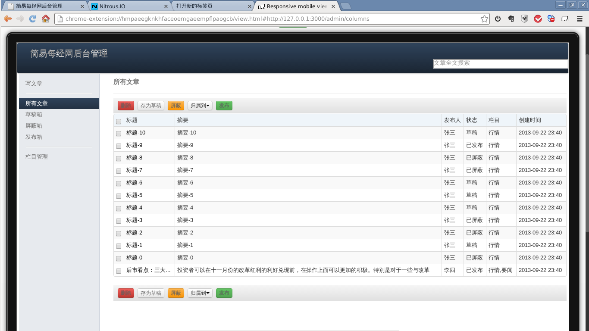
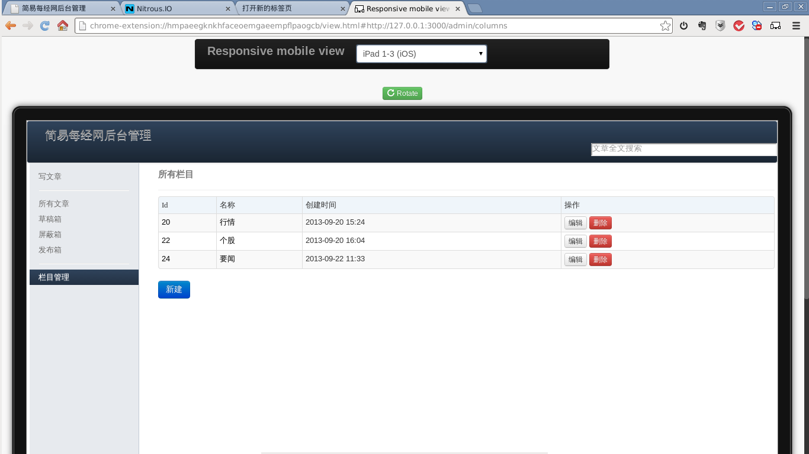
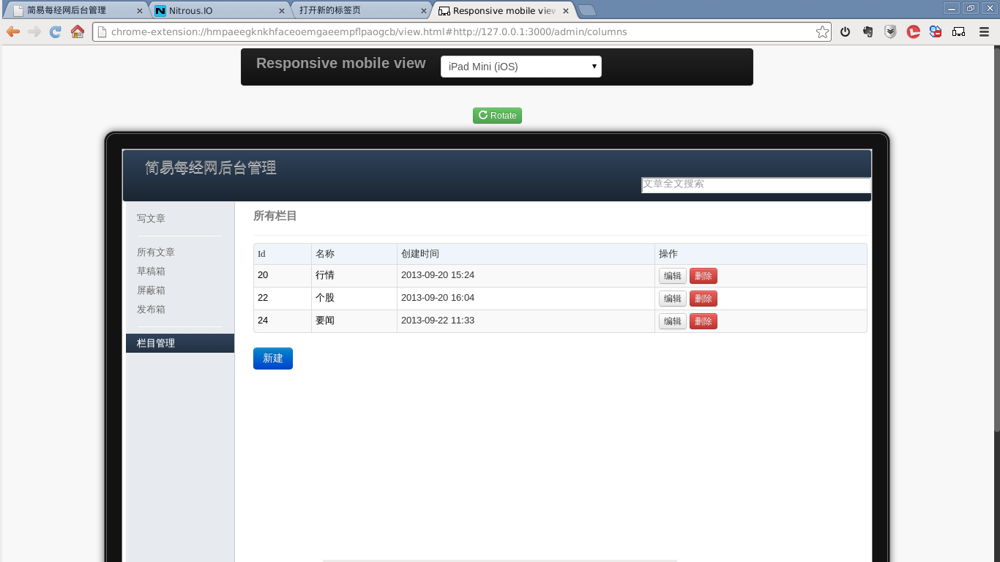
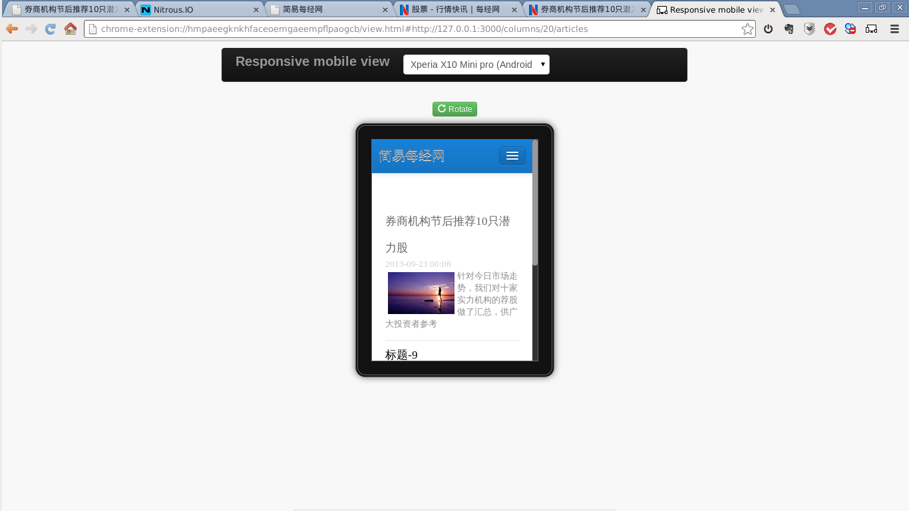
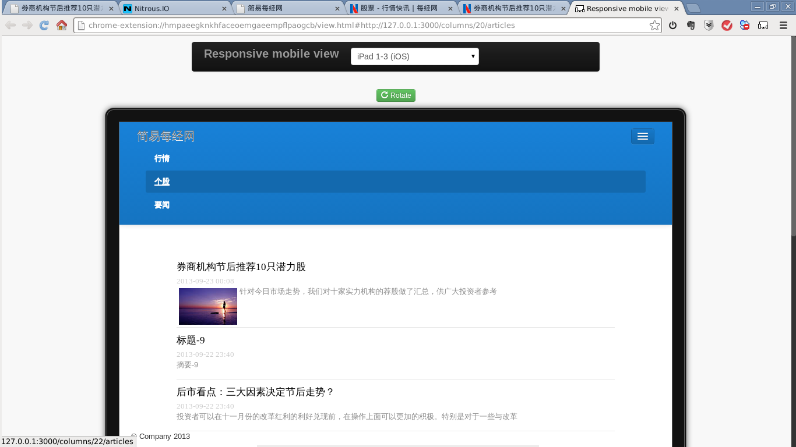
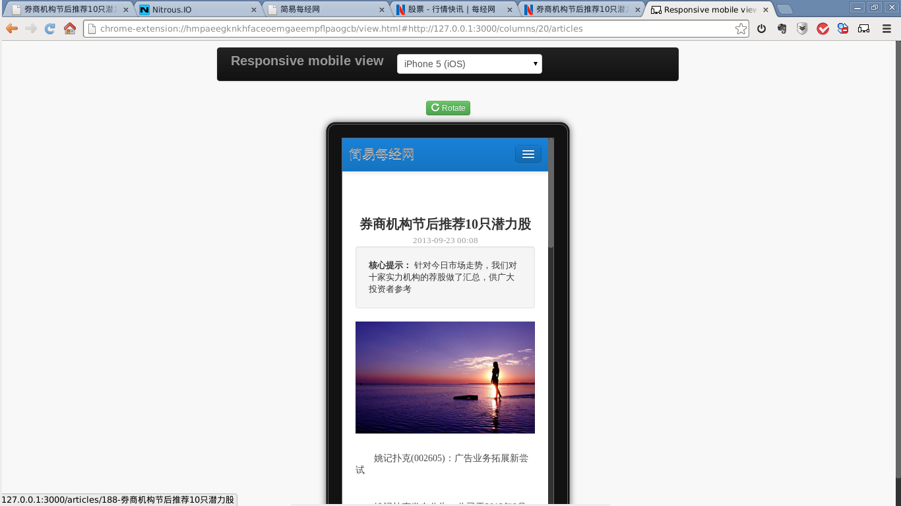
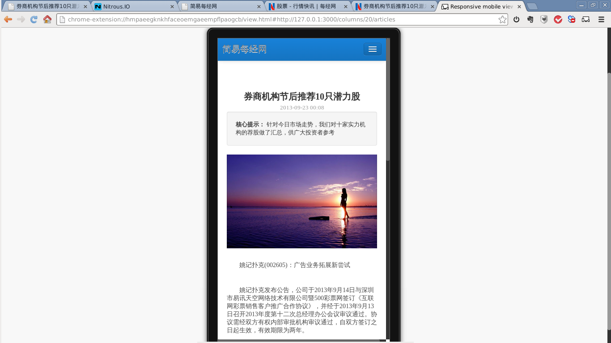
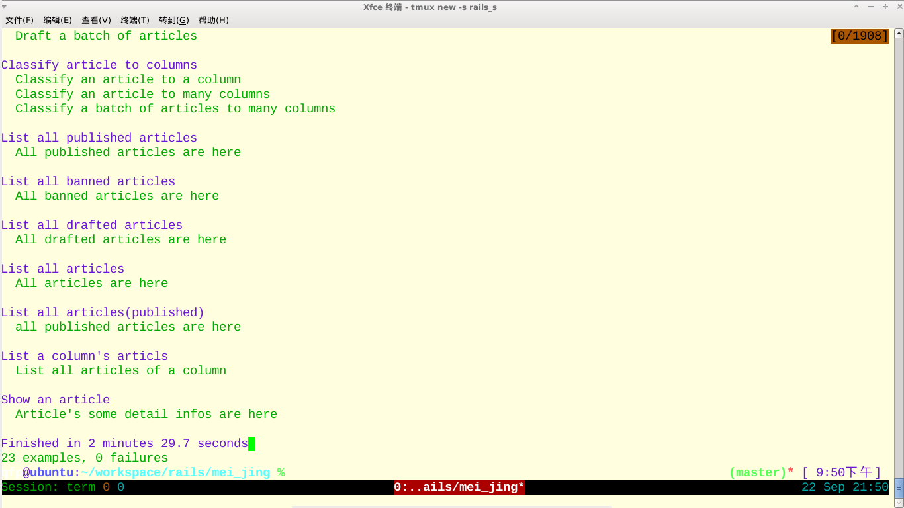
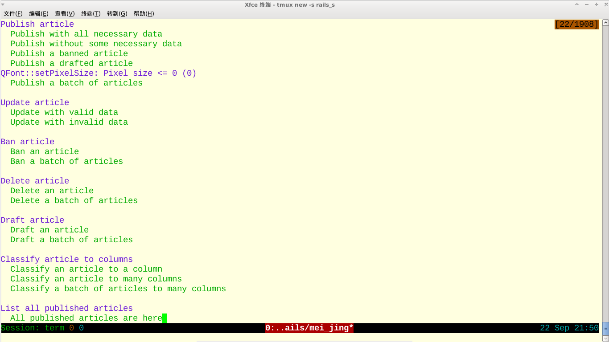

mei_jing
========

The homework of mei_jing's interview
### 相关说明
#### 响应式UI界面
##### 后台界面
后台所考虑的主要是包括ipadmini在内的较大屏幕。部分截图如下：

##### 前台台界面
前台界面基本上在大小屏幕上均可阅读， 部分截图如下：

#### 测试截图

#### 全文搜索引擎sunspot配合独立solr使用相关步骤
1. 运行根目录下的 install.sh，会在本目录下面生成一个sunspot_solr_mmseg4j目录(这里包括了jetty，solr的war文件，以及mmseg4j的集成).
即已经build和sunspot兼容的solr/mmseg4j版本，方便用来作中文的全文索引（sunspot自带的solr插件不支持中文检索）。
2. 在sunspot_solr_mmseg4j目录下， 执行java -jar start.jar，就能够启动一个solr server
3. 修改config/sunspot.yml 的响应模式端口为上面server的端口为8983
4. 运行 rake sunspot:reindex
相关参考资料：
* [中文索引相关](https://github.com/quake/sunspot_chinese_example)
* [sunspot](https://github.com/sunspot/sunspot)及其 [wiki](https://github.com/sunspot/sunspot/wiki)
* 

##### 访问地址
1. 前端访问地址 [http://ruby-rails-box-8958.apne1.actionbox.io:3000/articles](http://ruby-rails-box-8958.apne1.actionbox.io:3000/articles)
2. 后台访问地址
[http://ruby-rails-box-8958.apne1.actionbox.io:3000/admin/articles](http://ruby-rails-box-8958.apne1.actionbox.io:3000/admin/articles)
